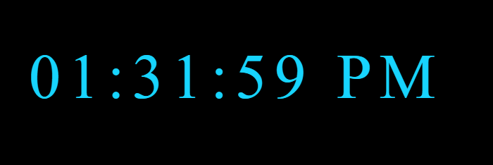

# ⏰ Digital Clock

A simple and stylish **digital clock** built with **HTML, CSS, and JavaScript**.  
It features a clean design with a glowing text effect and is centered perfectly on the screen.

---

## 🚀 Features
- Displays the current **time in real-time**  
- Modern **neon blue text styling**  
- Centered using CSS transform  
- Uses the **Orbitron font** for a futuristic look  
- Minimal, responsive design  

---

## 📂 Project Structure
digital-clock/
│── index.html # Main HTML structure
│── style.css # Styling for clock layout & design
│── script.js # JavaScript logic to update the time
│── README.md # Project documentation
│── images/
└── clock.png # Screenshot of the clock

---

## 🛠️ How to Use
1. Clone or download this repository.  
2. Open `index.html` in your browser.  
3. The clock will display and update in **real time**.  

---

## 📸 Screenshot

---

## 👨‍💻 Author
**Your Name**  
Made by ❤️❤️ Fawad Alam

---

## 📜 License
This project is open-source and free to use.
